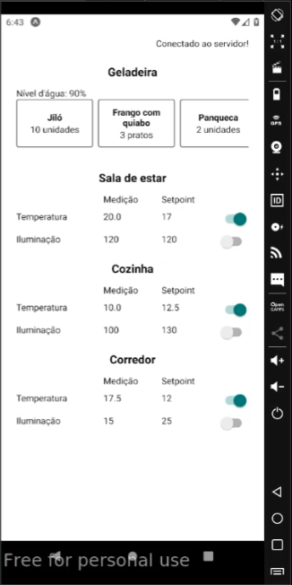

Pequeno projeto de uma casa inteligente, com monitoramente e controle de temperatura e iluminação + verificação de lista de itens no dispositivo IoT na geladeira.

Pode ser visto um passo a passo de como escrever esse projeto no instructables:

[Instructables](https://www.instructables.com/Pequeno-Projeto-De-Uma-Casa-Inteligente/)

Ou no Markdown nesse repositorio (preferível ler por aqui):

[Markdown](https://github.com/LuizFelipeCSalgado/smarthouse/instructables.md)
